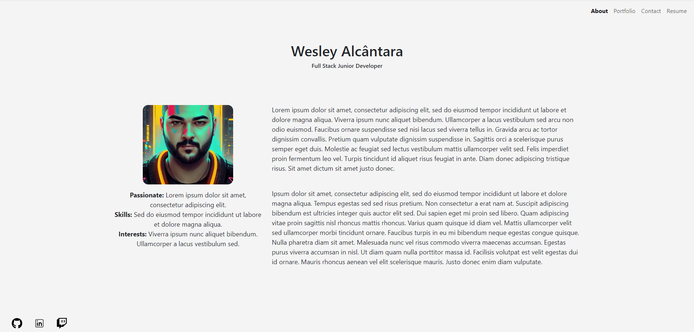

# React Portfolio

## Description

Welcome to my React portfolio! This project serves as a showcase of my skills, projects, and experiences as a developer. Built with React, this portfolio provides an interactive and visually appealing way for visitors to learn more about me and my work.

You can check the deployed application [here](https://wesleyhas.netlify.app/).

## Screenshots

## Table of Contents

- [Installation](#installation)
- [Usage](#usage)
- [Credits](#credits)
- [License](#license)
- [Features](#features)
- [Contribute](#contribute)
- [Tests](#tests)
- [Questions](#questions)

## Installation

N/A

## Usage

Click on the card in the portfolio section to be taken to the deployed application. Also repository link provided below the card.

## Credits

https://answers.netlify.com/t/images-do-not-present-on-netlify-after-deploying-but-they-work-well-on-the-local-host/66762/2

https://react-icons.github.io/react-icons/

## License

    This project is licensed under MIT.
    https://opensource.org/license/mit/

## Features

- **Responsive Design:** Ensuring a seamless experience across various devices and screen sizes.
- **Project Showcase:** Highlighting a selection of my projects with detailed descriptions and live demos.
- **Skills Section:** An overview of the technologies and skills I possess.
- **Contact Information:** Easy access to my social profiles and email for potential collaborations or inquiries.

## Contribute

N/A

## Tests

N/A

## Questions

If you have any questions please reach out at:

- GitHub: [WesleyHAS](https://github.com/WesleyHAS)
- Email: [wesley@email.com](mailto:wesley@email.com)
